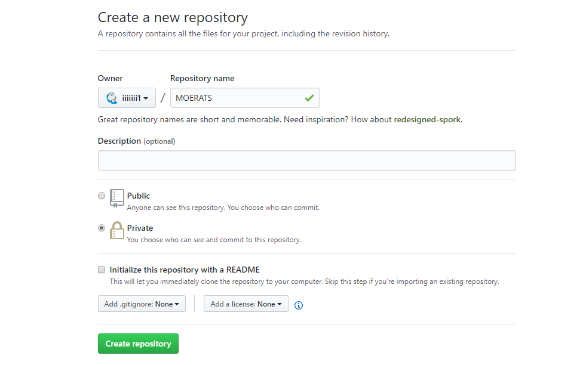
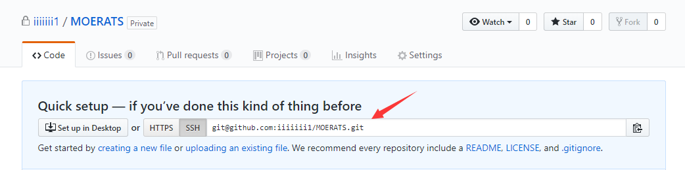
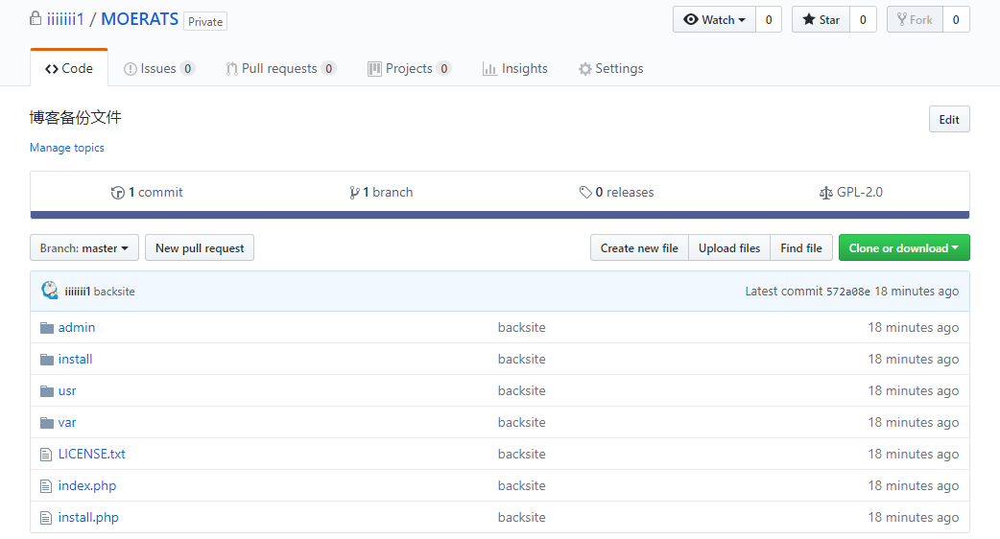
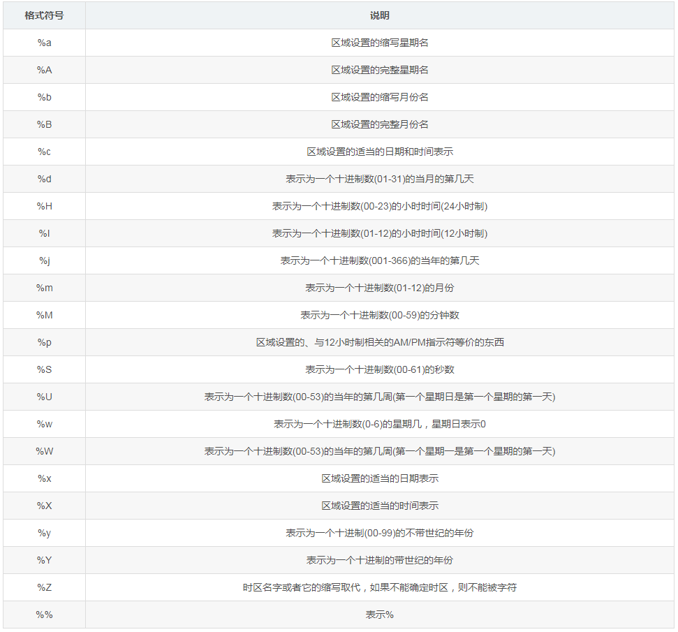

1、配置Git SSH密钥

由于本地Git仓库和GitHub仓库之间的传输是通过SSH加密的，所以必须要让github仓库认证你SSH key，在操作之前，需要先在服务器上生成SSH key。
我们先去根目录下使用命令：

cd ~
ssh-keygen -t rsa
这里会要你命名密匙名称(这里建议使用默认名称)，然后连续按几次Enter，这时候会在/root/.ssh文件夹生成2个ssh密钥，然后我们查看公钥id_rsa.pub。

cat ~/.ssh/id_rsa.pub
查看后，再复制下公钥，然后打开Github官网，进入https://github.com/settings/ssh/new，Title随便填，然后Key填入刚刚复制的密匙，最后点击Add SSH Key添加即可。


2、建立私人仓库
我们需要先访问https://github.com/new，新建一个仓库用来存放备份文件，名称自己随意，记得下面一定要勾选Private，也就是私人仓库。不然你辛辛苦苦备份的小姐姐就要被别人偷走了。


3、配置本地仓库
由于博主是用来备份网站，所以需要备份文件夹为/home/www.moerats.com，也就是把该文件夹定为本地仓库，使用命令：

#进入需要备份的文件夹
cd /home/www.moerats.com
#初始化你的github仓库
git init
#关联到远程github仓库
git remote add origin git@github.com:iiiiiii1/MOERATS.git
关联仓库的时候，后面可以用HTTPS链接也可以用SSH，这里强烈建议选择SSH，安全性很高。

4、初次备份

#进入备份的文件夹
cd /home/www.moerats.com
#把目录下所有文件更改状况提交到暂存区，包括增，删，改。
git add -A
#提交更改的说明，说明随意了，这里为backsite
git commit -m "backsite"
#开始推送到Github
git push -u origin master
推送的时候可能会提示The authenticity of host 'github.com' can't be established.信息，直进yes即可。

然后可以看到仓库的备份文件了。


5、设置定时备份
在根目录先新建一个bash脚本：

nano ~/gitback.sh
代码如下：

#!/bin/bash
#进入到网站根目录，记得修改为自己的站点
cd /home/xxx.com
#将数据库导入到该目录，这里以mysql为例，passwd为数据库密码，typecho为数据库名称，typecho.sql为备份的数据库文件
mysqldump -uroot -ppasswd typecho > typecho.sql
git add -A
git commit -m "backsite"
git push -u origin master
然后编辑好了后，使用ctrl+x，y保存退出。再测试下脚本，使用命令：

bash ~/gitback.sh
脚本没问题的话，再设置为每天05:15执行一次：

#并将运行日志输出到根目录的siteback.log文件
echo "15 05 * * * bash ~/gitback.sh > ~/siteback.log 2>&1 &" > bt.cron
crontab bt.cron
rm -rf bt.cron
最后使用crontab -l命令查看添加成功没。成功的话，就基本上算完成了。

推送失败
如果你将本地文件夹推送到Github失败的话，常见原因有2种，具体如下。

1、邮件问题

报错提示：Your push would publish a private email address.
这里可能是你将你的邮件地址私密了，解决方法如下：

#方法一，如果你想一直保持私密，可以选择方法二
访问https://github.com/settings/emails，将Keep my email address private的勾去掉。

#方法二
1、访问https://github.com/settings/emails，将Block command line pushes that expose my email的勾去掉。
2、设置你的github邮箱，修改成自己的再运行命令：
git config --global user.email "admin@moerats.com"
2、密匙问题

报错提示：Permission denied (publickey).
大概的原因就是，你设置密匙的时候改成了其它名称，而ssh默认只读取id_rsa，所以会显示没权限。解决方法如下：

#方法一
进入根目录的.ssh文件夹，将你的github密匙文件，重新更名为id_rsa。

#方法二
将github密匙添加到ssh agent，比如密匙名称为github，使用命令：
ssh-agent bash
ssh-add ~/.ssh/github

## rclone备份
crontab -e添加定时  crontab -l列出定时列表

| 命令                        | 解释                                                |
| :-----------------------    | :-------------------------------------------------- |
| /usr/bin/rclone             | rclone所在的位置                                     |
| copy                        | 复制指令                                            |
| /root/a                     | 本地所需要备份的文件路径                              |
| xhtg                        | rclone绑定网盘时的名字                               |
| /saju/$(date +%Y%m%d%H%M%S) | 网盘的储存路径，如果是根目录，可以直接“/”，例如：xhtg:/ |
| $(date +%Y%m%d%H%M%S)       | 以时间创建文件夹作为备份目录                          |

```
*/30 * * * * /usr/bin/rclone copy /root/a xhtg:/saju/$(date +%Y%m%d%H%M%S)
```

